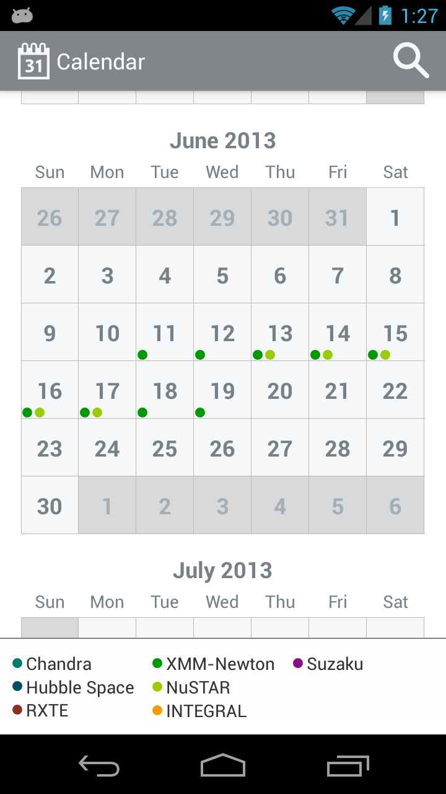
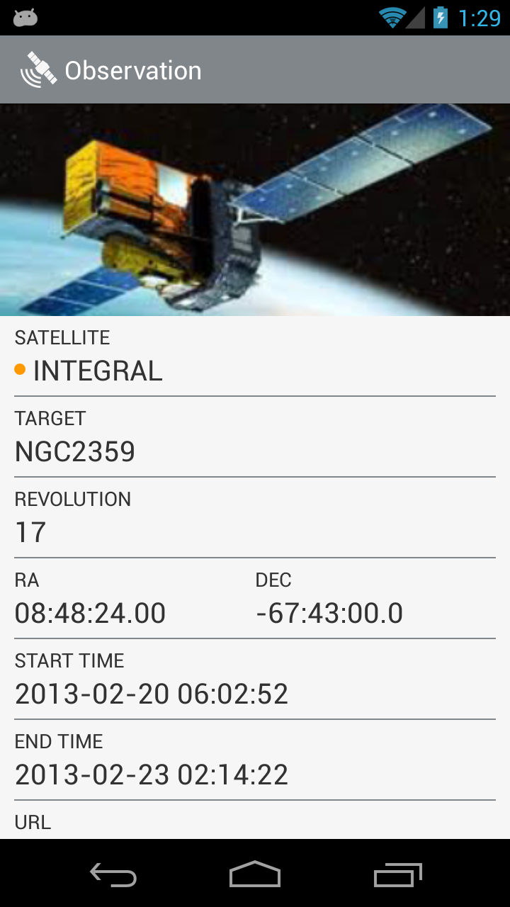

SpaceCalendar
=============

As part of one of the challenges for the SpaceApps Toronto (http://spaceappstoronto.com/) hackathon, an Android application to visually explore Observatory schedules

Uses https://github.com/HannahMitt/android-times-square as a git submodule

Calendar view:

Observation View:

